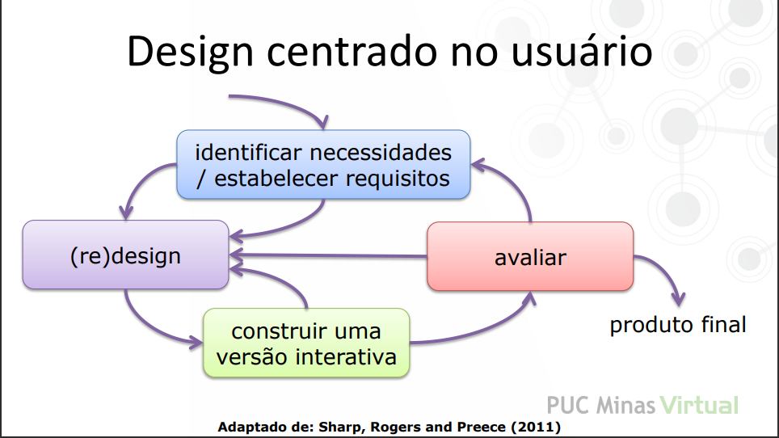

# Design de Interação

> [voltar](./index.md)

## Definições

- Por Alan Dix, papa da interação humano-computador (IHC):

> *"Interação é qualquer forma de comunicação entre um usuário e um computador, de maneira direta ou indireta, com a finalidade de realizar uma tarefa."*

- Pela Associação Internacional de Design (IxDA):

> *Design de Interação define a estrutura e comportamento de sistemas interativos. Designers de interação lutam para criar uma relacão significativa entre pessoas e produtos ou serviços.*

- Por Rogers Sharp and Preece

> *É o **projeto de produtos** interativos para apoiar a forma como as pessoas se comunicam ou interagem no seu dia a dia e em seus ambientes de trabalho. Sgnifica envolver o usuário no processo.*

## Aspectos da interação

1. Ambiente, meio de interação, aparelho.

2. Usuário

3. Tarefa realizada

- Interação é um processo de comunicação ou seja é necessário ter duas entidades. No caso da IHC, será um humano e outro uma **interface de software de qualquer natureza**.

- O usuário interage com a finalidade de realizar uma tarefa (atingir uma meta).

- Aparência e comportamento (look and fill) relação com signiciacado, com engajamento. O usuário deve querer usar o sistema

- Projetar produtos que o humano possa interagir

## Objetivo

- Produzir produtos usáveis com **usabilidade**

- Design centrado no usuário:

### Usabilidade

- Fácil de aprender
- Eficaz e eficiente
- Experiência agradável
